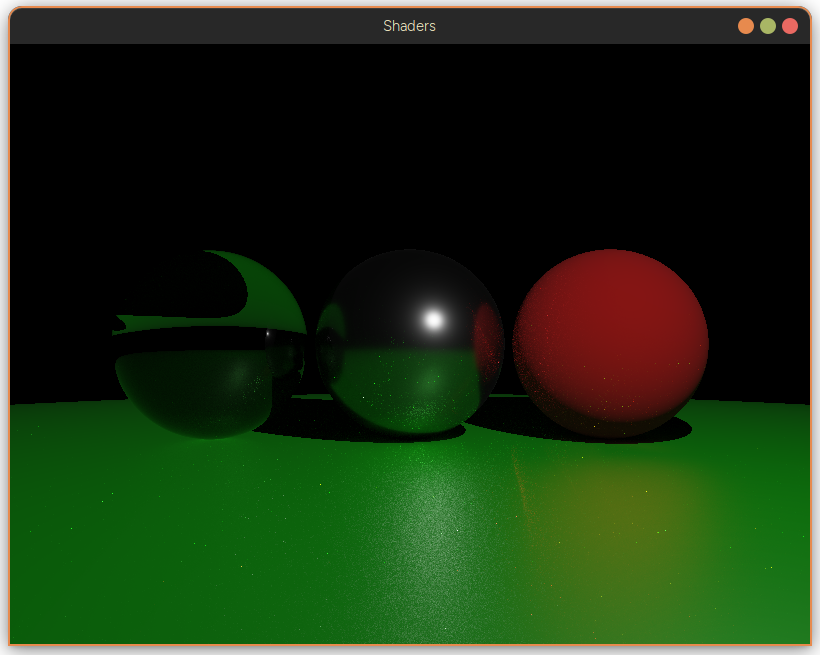

# Helios
A GPU-accelerated path tracer built in C++ using OpenGL compute shaders and GLSL for rendering, with ImGui for live scene/material editing.



## Build & Run

### Compile
```bash
cmake --build build
```

### Run
```bash
./build/helios
```

## Overview

This project is an implementation-focused exploration of GPU-based path tracing, covering ray-object intersection (spheres and triangle meshes), physically-based materials, multi-bounce global illumination, and a CPU-to-GPU scene pipeline. Rendering happens entirely on the GPU via a compute shader, with the CPU responsible for scene authoring, buffer uploads, and live material editing through an ImGui interface. Frames are progressively accumulated and displayed in real time.


## Features

The renderer supports sphere and indexed triangle mesh geometry, with a physically-based material model covering albedo, metallic, roughness, IOR, transmission, and emission. Materials are shaded using a Cook-Torrance specular BRDF (GGX distribution, Smith geometry term, Schlick Fresnel) combined with Lambertian diffuse, stochastically sampled and mixture-weighted for correct multi-bounce Monte Carlo integration.

Dielectric materials support physically-based reflection and refraction, including total internal reflection. Direct lighting is computed via explicit shadow rays, and scene data — geometry and materials alike — is authored on the CPU and uploaded to the GPU through a verified, `std430`-compliant buffer pipeline. Materials can be edited live through an ImGui interface, with only changed data re-uploaded to the GPU each frame.
