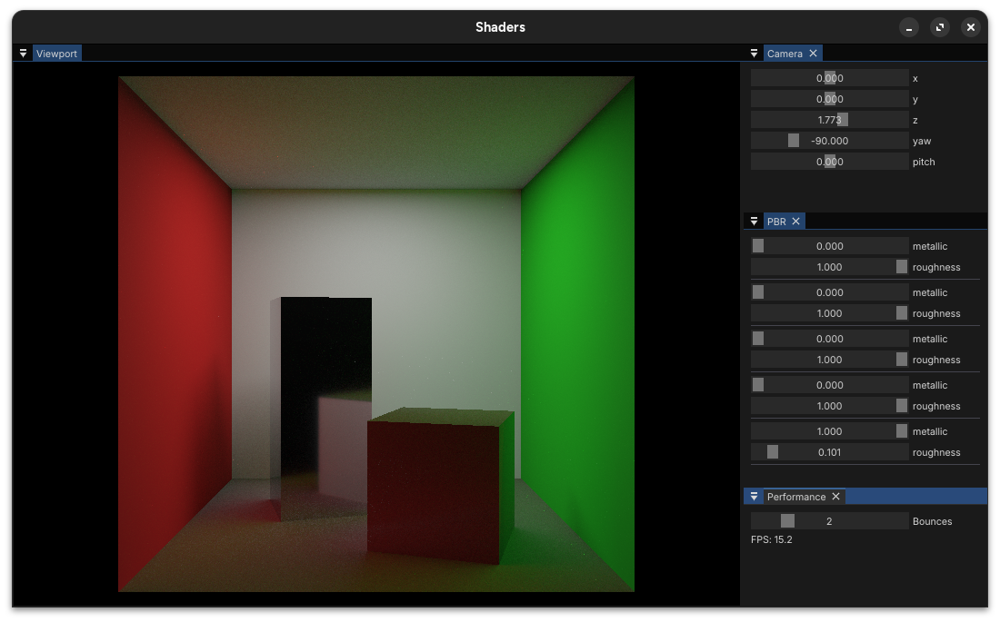
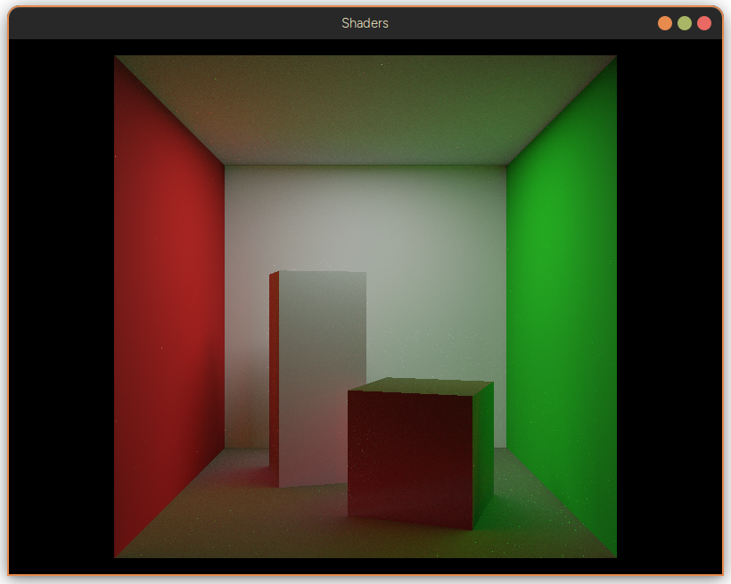
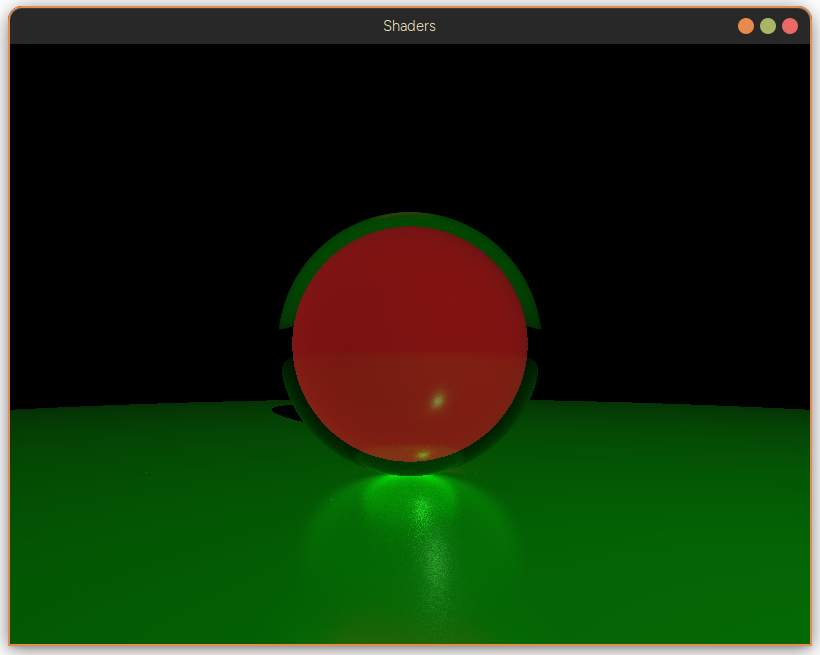
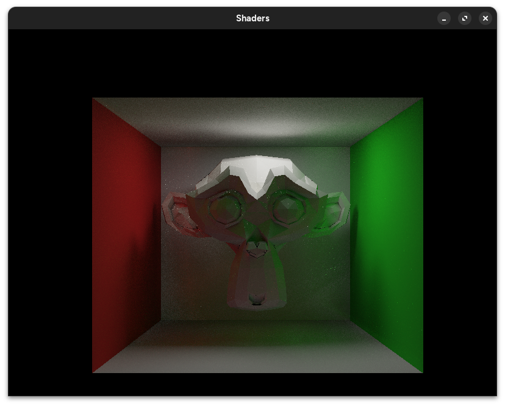

# Helios
A GPU-accelerated path tracer built in C++ using OpenGL compute shaders and GLSL for rendering, with ImGui for live scene/material editing.



## Build & Run

### Compile
```bash
cmake --build build
```

### Run
```bash
./build/helios
```

## Overview

Helios is a path tracer built around an OpenGL compute shader. The CPU handles scene setup and data management, while ray generation, intersection, shading, and accumulation run on the GPU.

The renderer supports spheres and indexed triangle meshes. Triangle meshes can be accelerated using a Bounding Volume Hierarchy (BVH), reducing the amount of geometry that needs to be tested for each ray.

Rendering is progressively accumulated over multiple frames. This makes it possible to render multiple samples per pixel over time rather than having to finish the entire path tracing process in a single frame.

## Features

The renderer supports sphere and indexed triangle mesh geometry. Triangle meshes can be accelerated using a Bounding Volume Hierarchy (BVH) for faster ray intersection.

Materials support albedo, metallic, roughness, IOR, transmission, and emission. The renderer uses a Cook-Torrance BRDF with GGX, Smith geometry, and Schlick Fresnel for specular reflection, along with Lambertian diffuse shading.

Dielectric materials support reflection and refraction, including total internal reflection. Direct lighting is handled using shadow rays, while additional light transport is handled through multiple path bounces.

Scene and material data are stored in GPU buffers using `std430` layouts. Materials can be edited at runtime through ImGui, with changes being uploaded without rebuilding the scene.

## Gallery
  
*Glass, metal and diffuse materials*

  
*Standard Cornell box*

  
*A smaller red sphere magnified through the glass sphere in front of it*

  
*Obj mesh rendering: Suzanne*
